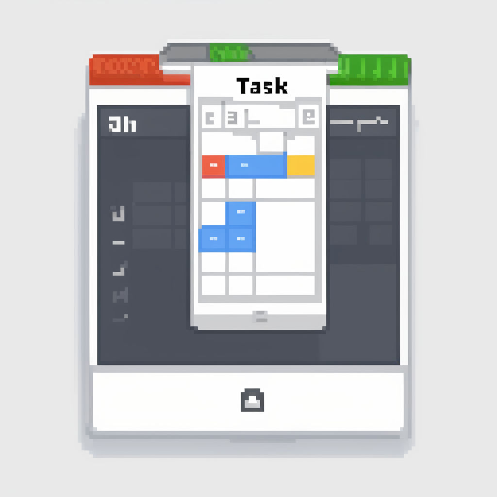

<h1 style="display: flex; align-items: center;">
  
  Task Manager
</h1>

## Access live project
Project is temporary available at: https://taskmanager.alcony.pl/

## Run project
To run You may use [my other repo](https://github.com/GrzegorzWalewski/bitnami-laravel-quickstart)

## Available views

### Guest view - quick overview of the project
  

### Dashboard   

### Profile with added API Tokens section   
  

## Tech stack
- PHP
- Laravel
- Livewire
- tailwindCss
- flowbite
